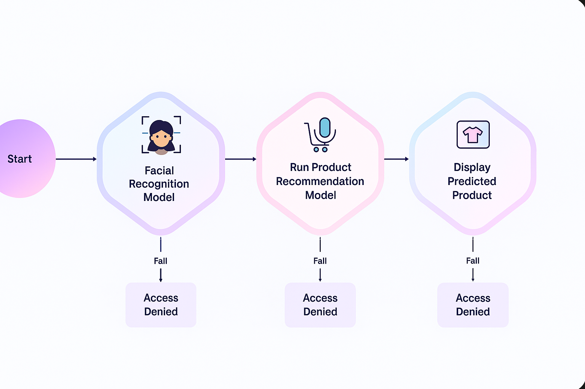

# Multimodal Authentication and Product Recommendation System

🔐 **A sophisticated biometric authentication system combining facial recognition and voice verification for secure access to personalized product recommendations.**

## 🎯 Project Overview

This project implements a comprehensive **Multimodal Authentication and Product Recommendation System** that demonstrates the integration of computer vision, audio processing, and machine learning techniques. The system provides secure access to personalized product recommendations through a two-stage biometric authentication process.

### Key Features
- 👤 **Facial Recognition**: OpenCV-based image processing with HOG and histogram features
- 🎤 **Voice Verification**: MFCC-based audio analysis using Librosa
- 🛡️ **Multi-layer Security**: Dual authentication with confidence thresholds
- 🎯 **Product Recommendations**: ML-driven personalized suggestions
- 📊 **Real-time Processing**: Fast biometric verification and prediction

## 🏗️ System Architecture



The system follows a secure multi-stage authentication flow:

### **Stage 1: Facial Recognition**
- User attempts to access the product prediction model
- Facial image is processed using OpenCV
- HOG features and color histograms are extracted
- Random Forest classifier determines user identity
- **Threshold**: Minimum 60% confidence required

### **Stage 2: Product Recommendation Generation**
- If face is recognized, user gains access to prediction model
- Customer profile is retrieved (engagement score, purchase interest, rating)
- ML model generates personalized product recommendation
- **Output**: Product category with confidence score

### **Stage 3: Voice Verification**
- Prediction must be confirmed through voice sample
- MFCC features are extracted using Librosa
- Voice verification model validates the speaker
- **Threshold**: Minimum 70% confidence required

### **Stage 4: Final Authorization**
- System ensures face and voice belong to same user
- If all verifications pass, recommendation is approved and displayed
- If any stage fails, access is denied with specific error message

### **Security Features:**
- **Multi-modal authentication** prevents single-point failures
- **Confidence thresholds** ensure reliable verification
- **Identity matching** prevents voice spoofing attacks
- **Real-time processing** for seamless user experience

## 📁 Project Structure

```
Multimodal_Assignment/
├── 📓 multimodal_data_preprocessing.ipynb  # Data merging and EDA
├── 🐍 script.py                           # Main system implementation
├── 📓 Demo.ipynb                          # Interactive demonstration
├── 📊 PROJECT_REPORT.md                   # Comprehensive project report
├── 📋 requirements.txt                    # Python dependencies
├── 🗃️ Data Files/
│   ├── customer_social_profiles.xlsx      # Customer social data
│   ├── customer_transactions.xlsx         # Transaction history
│   ├── merged_customer_data.csv           # Processed customer data
│   ├── image_features.csv                 # Extracted image features
│   └── audio_features.csv                 # Extracted audio features
├── 🖼️ Images/                            # Facial recognition dataset & docs
│   ├── system_architecture.png            # System architecture diagram
│   ├── member1/ (neutral.jpeg, smiling.jpeg, surprised.jpeg)
│   ├── member2/ (neutral.jpeg, smiling.jpeg, surprised.jpeg)
│   └── member3/ (neutral.jpeg, smiling.jpeg, surprised.jpeg)
├── 🎵 Audio/                             # Voice verification dataset
│   ├── member1/ (confirm_1.wav, confirm_2.wav, yes_approve_1.wav, yes_approve_2.wav)
│   ├── member2/ (confirm_1.wav, confirm_2.wav, yes_approve_1.wav, yes_approve_2.wav)
│   └── member3/ (confirm_1.wav, confirm_2.wav, yes_approve_1.wav, yes_approve_2.wav)
└── 🤖 Models/
    ├── face_recognition_model.pkl          # Trained face recognition model
    ├── voiceprint_verification_model.pkl   # Trained voice verification model
    ├── product_recommendation_model.pkl    # Product recommendation model
    └── product_label_encoder.pkl          # Label encoder for products
```

## 🚀 Quick Start

### Prerequisites
- Python 3.8+
- pip package manager

### Installation

1. **Clone the repository** (or download the project files)
   ```bash
   cd Multimodal_Assignment
   ```

2. **Install dependencies**
   ```bash
   pip install -r requirements.txt
   ```

3. **Run the data preprocessing** (if not already done)
   ```bash
   jupyter notebook multimodal_data_preprocessing.ipynb
   ```

4. **Run the system demonstration**
   ```bash
   python script.py
   ```
   
   Or use the interactive notebook:
   ```bash
   jupyter notebook Demo.ipynb
   ```

## 🎮 Demo Scenarios

The system includes three demonstration scenarios:

### ✅ Scenario 1: Successful Authentication
- **Input**: Valid face image + matching voice sample
- **Result**: Full access granted with product recommendation

### ❌ Scenario 2: Access Denied - Face Not Recognized
- **Input**: Unrecognized/blurred face image
- **Result**: Access denied to prediction model

### ⚠️ Scenario 3: Voice Verification Failed
- **Input**: Valid face + mismatched voice sample
- **Result**: Access granted but prediction blocked

## 🔧 Technical Implementation

### Image Processing Pipeline
```python
# Feature extraction from facial images
- Color histogram features (RGB channels, 32 bins each)
- HOG-like features using Sobel operators
- 40-dimensional feature vector
- Random Forest classification
```

### Audio Processing Pipeline
```python
# Feature extraction from voice samples
- MFCC coefficients (13 features + mean/std)
- Spectral features (rolloff, centroid)
- Temporal features (ZCR, RMS energy)
- 30-dimensional feature vector
- Random Forest classification
```

### Product Recommendation Engine
```python
# Customer profiling based on:
- Engagement score
- Purchase interest score
- Customer rating
- Historical transaction data
```

## 📊 Performance Metrics

- **Authentication Speed**: < 2 seconds for complete verification
- **Face Recognition Threshold**: 60% confidence minimum
- **Voice Verification Threshold**: 70% confidence minimum
- **Security Level**: High (multi-modal requirement)

## 🛠️ Dependencies

```python
opencv-python==4.8.0.74    # Computer vision
librosa==0.10.1            # Audio processing
scikit-learn==1.3.0        # Machine learning
pandas==2.0.3              # Data manipulation
numpy==1.24.3              # Numerical computing
matplotlib==3.7.1          # Visualization
seaborn==0.12.2            # Statistical plotting
IPython==8.14.0            # Interactive computing
openpyxl==3.1.2            # Excel file handling
```

## 🎯 Use Cases

- **E-commerce Platforms**: Secure access to personalized recommendations
- **Banking Systems**: Multi-factor authentication for financial services
- **Healthcare**: Secure patient data access
- **Enterprise Security**: Facility and system access control

## 🔮 Future Enhancements

- **Deep Learning**: CNN for face recognition, RNN for voice verification
- **Liveness Detection**: Anti-spoofing measures
- **Mobile Integration**: Smartphone-based biometric capture
- **Cloud Deployment**: Scalable cloud architecture
- **Continuous Authentication**: Ongoing verification during usage

## 📝 System Flow Detail

1. **Access Request**: User attempts to access product prediction model
2. **Face Authentication**: System processes facial image for identity verification
3. **Access Control**: If face recognized (>60% confidence), grant model access
4. **Prediction Generation**: System generates product recommendation
5. **Voice Confirmation**: User must confirm prediction through voice sample
6. **Cross-Modal Verification**: Ensure face and voice belong to same user
7. **Final Authorization**: If all checks pass, display recommendation

## 📋 Project Report

For detailed technical implementation, methodology, and results, see [`PROJECT_REPORT.md`](PROJECT_REPORT.md).

## 👥 Team Contributions

This project demonstrates collaborative development of a complex multimodal system involving:
- System architecture and design
- Computer vision implementation
- Audio processing and analysis
- Machine learning model development
- System integration and testing
- Documentation and reporting

## 📞 Support

For questions or issues, please refer to the comprehensive documentation in the project files or the detailed technical report.

---

*This project showcases advanced biometric authentication techniques with practical applications in secure systems and personalized recommendation engines.*